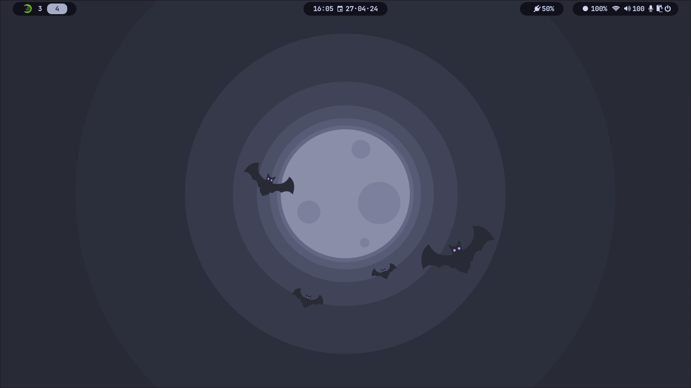

# Joe's dotfiles

## Preview

Desktop preview:

kitty + tmux preview:

## Installation

- Install OpenSUSE Tumbleweed server
- Install [JaKooLit OpenSuse-Hyprland](https://github.com/JaKooLit/OpenSuse-Hyprland?fbclid=IwAR3Rzc_MFDQIDP3Ql6kbvQmWMFSuTwKqsiOSk9eQqM9MAaTC34tLbsGomvU)

  - nvidia: y, gtk themes: y, bluetooth: y, thunar:n, sddm:n, xdg: y, zsh:y,asus rog laptops:n,dotfiles:n
  - TODO: fork this repo and add the following packages

### Terminal

- neofetch
- kitty
- neovim
- LazyVim prerequisites
- xclip, hyprpaper, dolphin, fd, texlive-latex-bin, exa, loupe
- stow
- sudo zypper in starship
- eval "$(starship init zsh)"

### lf

- sudo zypper in ueberzugpp GraphicsMagick ffmpeg-6 ffmpeg-7 ghostscript lf

### Waybar

- sudo zypper in rofi rofi-calc wofi dunst waybar
- sudo zypper in papirus-icon-theme

### AGS

- Build AGS from source [AGS Wiki Installation](https://aylur.github.io/ags-docs/config/installation/)
  - Dependencies: sudo zypper install typescript npm-default meson libgjs-devel gjs gtk3-devel gtk-layer-shell-devel libgtk-layer-shell0 gnome-bluetooth typelib-1_0-GnomeBluetooth-3_0 upower NetworkManager libdbusmenu-gtk3-4 typelib-1_0-DbusmenuGtk3-0_4 libdbusmenu-gtk3-devel libsoup-3_0-0 gobject-introspection libpulse-devel
- sudo zypper install sassc, brightnessctl, swww, cargo
- sudo npm install -g sass
- cargo install matugen
- [Aylur dotfiles](https://github.com/Aylur/dotfiles.git)
  - Dependencies: bun

### hyprcursor

- [xcur2png](https://github.com/eworm-de/xcur2png)
- dependencies: sudo zypper in libpng12-devel libXcursor-devel
- download and install [release of original xcur2png-0.7.1.tar.gz Latest](https://github.com/eworm-de/xcur2png/releases/tag/0.7.1)
  - cd xcur2png-0.7.1
  - ./configure --prefix=/usr
  - make
  - sudo make install
- sudo zypper in hyprcursor
- hyprctl setcursor Bibata-Modern-Classic
- sudo zypper in flatpak flatseal
- add flathub repos
  flatpak install flathub com.github.tchx84.Flatseal
  sudo flatpak override --filesystem=$HOME/.themes
  sudo flatpak override --filesystem=$HOME/.icons
  sudo flatpak override --env=ICON_THEME=Bibata-Modern-Classic

## TODO

- clipboard manager
- hyprcursor and xcursor
- dolphin config
- figure out ags
- app launcher like pop launcher
- vertical workspaces?
- import my kitty, tmux and neovim config
- change tmux and neovim themes to dracula
- kitty custom icon + script to automate that
- customize kitty icon
- new leader key for tmux
- resource monitor in topbar
- bashrc and zshrc
- use starship
- use gnu stow (or equivalent)
- custom icon pack
- OpenSUSE icon in top bar!!!!! très important!!
- open kitty with tmux automaticaly in the first workspace
- touchpad gestures

### Dumb

- how do I resize windows?

### Maybe?

- hotswap themes?
- change hyprland animations
- no gaps or active border for workspaces with only one window?
